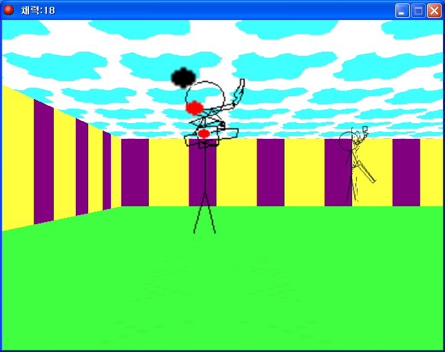

# 3D셔든어택

게임메이커에 내장된 d3d 함수로 만든 1인칭 슈팅 게임이다. 인기 FPS였던 서든어택을 오마주하면서 이름은 한 글자만 비틀었다.

<p>
  
</p>


## 플레이 방법

Releases에서 받아 실행하면 된다.

W와 S로 앞뒤로 움직이고 A와 D로 시점을 돌린다. 마우스 좌클릭으로 쏜다. 몬스터는 평소에는 가만히 있다가 가까워지면 쫓아온다. 남은 목숨은 창 제목표시줄에 나온다.


## 구현 원리

플레이어 오브젝트가 만들어질 때 3D 모드를 켜고, 매 프레임 Draw 이벤트에서 자기 위치와 바라보는 방향으로 시점을 다시 잡는다. 바닥과 하늘은 룸 전체 크기의 면 두 장을 위아래로 깔아 만들었다.

벽은 2D 룸에 놓은 오브젝트가 각자 자기를 3D로 세우는 구조다. 그리기를 맡는 부모 오브젝트 하나가 벽 그리기 함수를 호출하고, 가로벽과 세로벽 오브젝트는 그 자식으로 두어 생성될 때 자기 위치를 기준으로 벽 양 끝의 좌표와 높이, 텍스처만 정해준다.

```gml
// 가로벽
{
  x1 = x-16;
  x2 = x+16;
  y1 = y;
  y2 = y;
  z1 = 32;
  z2 = 0;
  tex = background_get_texture(wall);
}
```

그래서 맵을 만들 때는 위에서 내려다보는 2D 룸에 벽 오브젝트를 늘어놓기만 하면 된다.


## 파일

| 경로 | 내용 |
|---|---|
| `source/3d-shudden-attack.gmk` | 원본 프로젝트 파일 |
| `source/lib/AI.lib` | 몬스터 감지에 쓴 액션 라이브러리. 게임메이커의 `lib` 폴더에 넣어야 프로젝트가 열린다 |
| `source/split/` | GmkSplitter로 분해한 텍스트 트리 |
| `docs/screenshots/` | 스크린샷 |
| Releases | 배포용 파일 |


## 크레딧

`source/lib/AI.lib` 은 멍멍이(qw5628)님이 만든 액션 라이브러리다.


## 라이선스

CC BY-NC-ND 4.0 라이선스다. 출처를 밝히면 비상업 용도로 그대로 공유할 수 있고, 수정본 배포와 상업적 이용은 금지한다. 함께 들어 있는 것 중 다른 사람이 만든 라이브러리와 그림·소리·맵은 각자의 권리를 따른다. 자세한 내용은 [LICENSE](LICENSE) 에 있다.
